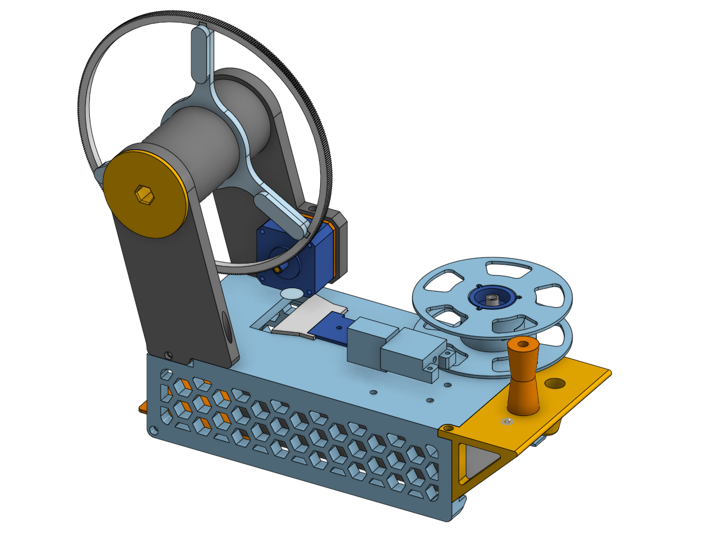
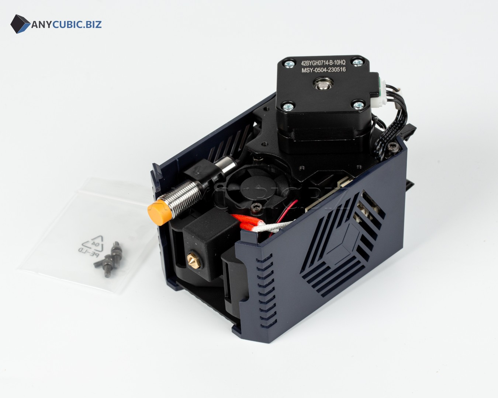
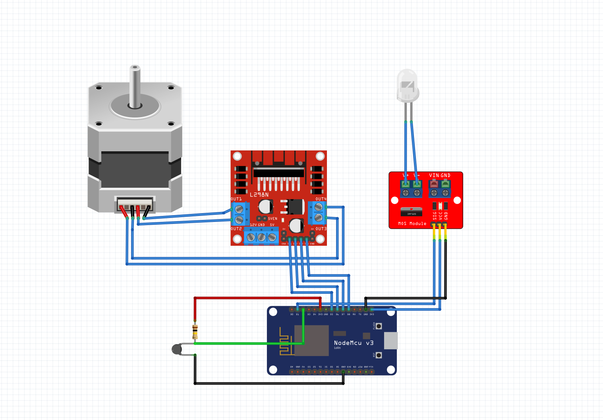

# PETG to Filament Bottle recycler!

Name pretty much says it all, this is a project to try and recycle the mountain of iced tea bottles ive got into filament! Ive seen people do this years ago, but didnt really have any CAD or electronics skills back then, and really wanted to make something like that too, since 30€ per kg of filament seems overpriced and i would really prefer to spend my money on aliexpress instead.

I tried to use as many components from an Anycubic Kobra 2 Hotend in this project, since i had one laying around (and which i bought for only 10 bucks, damn good deal), and ended up using pretty much everything i could: The stepper motor from the extruder, the hotend itself(duh), practically all the screws, and even the PCB that controlled (or rather had all the connectors, the only thing except traces on that thing is a couple of diodes lol) the whole thing!

The contraption itself is controlled by an ESP32, for the stepper i used a L298N i had laying around, and for the heating element i had to get a mosfet breakout.

### Wiring diagram

## BOM

This is all the extra stuff i had to buy and didnt have around!

|Name                     |Cost (per unit, in €)|Amount|Cost (€)|Link                                                                                                                                                                                                                                                        |
|-------------------------|---------------------|------|---------|------------------------------------------------------------------------------------------------------------------------------------------------------------------------------------------------------------------------------------------------------------|
|5A 24V PSU               |13,98                |1     |13,98    |https://www.aliexpress.com/item/33051556213.html?spm=a2g0o.cart.0.0.7fe438daX43lh2&mp=1&pdp_npi=5%40dis%21EUR%21EUR%2014.31%21EUR%2013.89%21%21EUR%2013.61%21%21%21%402103864c17656631570483822e5cd4%2112000016440247461%21ct%21PT%216268751524%21%211%210  |
|24V to 5A DC-DC converter|2,88                 |1     |2,88     |https://www.aliexpress.com/item/1005007259901753.html?spm=a2g0o.cart.0.0.7fe438daX43lh2&mp=1&pdp_npi=5%40dis%21EUR%21EUR%203.19%21EUR%202.88%21%21EUR%202.88%21%21%21%402103864c17656631570483822e5cd4%2112000039979305524%21ct%21PT%216268751524%21%211%210|
|MOSFET Breakout          |1,22                 |1     |1,22     |https://www.aliexpress.com/item/1005008554454996.html?spm=a2g0o.cart.0.0.7fe438daX43lh2&mp=1&pdp_npi=5%40dis%21EUR%21EUR%202.45%21EUR%201.22%21%21EUR%201.20%21%21%21%402103864c17656631570483822e5cd4%2112000045690084242%21ct%21PT%216268751524%21%211%210|
|Trapezoidal Blade        |0,89                 |1     |0,89     |https://www.aliexpress.com/item/1005007677799664.html?spm=a2g0o.cart.0.0.7fe438daX43lh2&mp=1&pdp_npi=5%40dis%21EUR%21EUR%201.96%21EUR%201.89%21%21EUR%201.79%21%21%21%402103892f17656695353376271e234c%2112000041773899842%21ct%21PT%216268751524%21%211%210|
|Wire Crimps Set          |3,69                 |1     |3,69     |https://a.aliexpress.com/_EzglbQU                                                                                                                                                                                                                           |
|Stepped drill bit        |1,09                 |1     |1,09     |https://a.aliexpress.com/_EJElGGy                                                                                                                                                                                                                           |
|M3 nuts                  |0,39                 |1     |0,39     |https://a.aliexpress.com/_EuZlNXO                                                                                                                                                                                                                           |
|                         |                     |      |         |                                                                                                                                                                                                                                                            |
|                         |Total (€):           |24,14 |         |                                                                                                                                                                                                                                                            |
